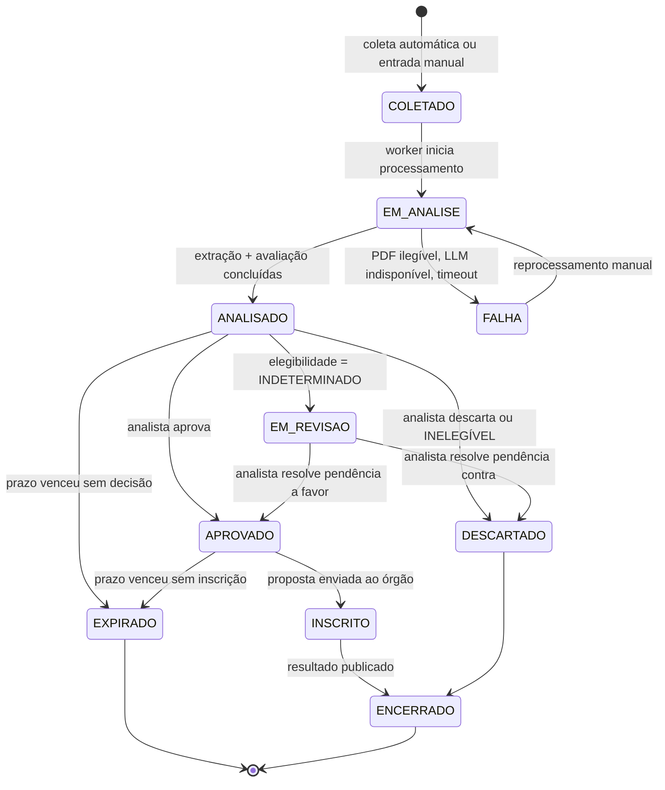

# Especificação Funcional Simplificada

## Gestor Inteligente de Editais — I9+

|              |                                                                                    |
| ------------ | ---------------------------------------------------------------------------------- |
| **Versão**   | 0.1 (rascunho para validação com o parceiro)                                       |
| **Data**     | Setembro de 2026                                                                   |
| **Escopo**   | Instância única (single-tenant) — atende apenas a I9+                              |
| **Natureza** | Documento-guia. Descreve o que **pode** ser desenvolvido, não um contrato fechado. |

---

## 1. Visão Geral

O Gestor Inteligente de Editais é um sistema web que centraliza a captação, a leitura automatizada e a priorização de editais de fomento, licitações e chamadas públicas relevantes para a I9+.

Hoje o processo é manual: a equipe recebe editais por e-mail e LinkedIn, acessa portais periodicamente, registra tudo em planilhas estáticas e precisa ler documentos densos por inteiro apenas para descobrir se a empresa é sequer elegível. Prazos são perdidos por falta de alerta e inscrições são feitas em editais nos quais uma cláusula específica desqualifica a empresa.

O sistema resolve isso capturando editais de múltiplas fontes, extraindo os dados relevantes de cada documento com apoio de um modelo de linguagem, comparando esses dados com o perfil cadastrado da empresa e apresentando ao analista uma fila priorizada com **status de elegibilidade**, **nota de fit comercial** e **evidência textual** de cada conclusão. Alertas automáticos por e-mail avisam sobre prazos e oportunidades de alto fit.

**Princípio arquitetural central:** o modelo de linguagem **extrai fatos**; o motor de regras **toma decisões**. A IA nunca inventa a nota.

---

## 2. Atores e Níveis de Acesso

| Ator         | Descrição                                                                  | Permissões                                                                                                         |
| ------------ | -------------------------------------------------------------------------- | ------------------------------------------------------------------------------------------------------------------ |
| **Analista** | Opera o sistema no dia a dia. Revisa análises, aprova ou descarta editais. | Ler tudo. Criar entradas manuais. Revisar e corrigir avaliações. Alterar status de edital.                         |
| **Gestor**   | Acompanha o funil e define a estratégia de captação.                       | Tudo do Analista, mais: editar Perfil da Empresa, Critérios e Pesos, Fontes Monitoradas e Configurações de Alerta. |
| **Sistema**  | Ator não-humano. Executa coleta, extração e avaliação.                     | Criar e atualizar editais e avaliações. Disparar notificações.                                                     |

**Autenticação:** login por e-mail e senha, sessão via cookie. Sem cadastro público — usuários são criados por seed ou por um Gestor. Sem recuperação de senha automatizada no MVP.

### Tabela `usuario`

| Campo        | Tipo         | Obrig. | Observação             |
| ------------ | ------------ | ------ | ---------------------- |
| `id`         | uuid         | sim    | PK                     |
| `nome`       | varchar(120) | sim    |                        |
| `email`      | varchar(160) | sim    | único                  |
| `senha_hash` | varchar(255) | sim    | bcrypt ou argon2       |
| `papel`      | enum         | sim    | `ANALISTA` \| `GESTOR` |
| `ativo`      | boolean      | sim    | default `true`         |
| `criado_em`  | timestamptz  | sim    |                        |

---

## 3. Glossário do Domínio

| Termo                 | Definição                                                                                                                                       |
| --------------------- | ----------------------------------------------------------------------------------------------------------------------------------------------- |
| **Edital**            | Documento público que abre uma oportunidade de fomento, crédito, subvenção, prêmio ou contratação. Unidade central do sistema.                  |
| **Fonte**             | Origem monitorada de onde editais são coletados (portal, RSS, e-mail, upload manual).                                                           |
| **Extração**          | Processo de ler o documento e converter texto livre em campos estruturados. Executado com apoio de LLM.                                         |
| **Evidência**         | Trecho literal do edital, com número de página, que justifica um campo extraído. Toda afirmação do sistema deve ser rastreável a uma evidência. |
| **Perfil da Empresa** | Conjunto de dados cadastrais e estratégicos da I9+ usado como referência de comparação.                                                         |
| **Critério**          | Regra configurável que compara um campo do edital com um campo do perfil. Pode ser eliminatório ou pontuável.                                   |
| **Elegibilidade**     | Resultado **binário e eliminatório**: a empresa pode ou não pode participar. Independe da nota.                                                 |
| **Fit Comercial**     | Resultado **gradual** de 0 a 100 que indica o quanto a oportunidade interessa estrategicamente. Só é calculado se o edital for elegível.        |
| **Indeterminado**     | Estado em que o sistema não encontrou a informação necessária no documento. Exige verificação humana. Nunca é convertido em chute.              |
| **Avaliação**         | Registro do resultado de elegibilidade + nota de fit para um edital, em um dado momento e com uma dada versão do perfil.                        |
| **Revisão**           | Ação humana de confirmar, corrigir ou descartar o resultado de uma avaliação.                                                                   |
| **Chat do Edital**    | Conversa com assistente de IA restrita ao conteúdo de um edital específico. Não altera dados, apenas responde perguntas.                        |

---

## 4. Ciclo de Vida do Edital

Todo edital percorre uma máquina de estados. O campo `edital.status` nunca é alterado livremente: apenas pelas transições abaixo.



### Tabela de transições

| De                         | Para         | Quem dispara        | Condição                                       |
| -------------------------- | ------------ | ------------------- | ---------------------------------------------- |
| —                          | `COLETADO`   | Sistema / Usuário   | Edital entra por qualquer via                  |
| `COLETADO`                 | `EM_ANALISE` | Sistema             | Worker pega o item da fila                     |
| `EM_ANALISE`               | `ANALISADO`  | Sistema             | Extração e avaliação bem-sucedidas             |
| `EM_ANALISE`               | `FALHA`      | Sistema             | Erro técnico ou documento ilegível             |
| `FALHA`                    | `EM_ANALISE` | Usuário             | Botão "Reprocessar"                            |
| `ANALISADO`                | `EM_REVISAO` | Sistema             | Há ao menos um critério indeterminado          |
| `ANALISADO` / `EM_REVISAO` | `APROVADO`   | Analista            | Decisão de participar                          |
| `ANALISADO` / `EM_REVISAO` | `DESCARTADO` | Analista ou Sistema | Decisão de não participar ou `INELEGÍVEL`      |
| `APROVADO`                 | `INSCRITO`   | Analista            | Confirma envio da proposta                     |
| `INSCRITO`                 | `ENCERRADO`  | Analista            | Registra resultado (ganho/perdido)             |
| qualquer ativo             | `EXPIRADO`   | Sistema             | `prazo_inscricao < hoje` e status não terminal |

**Regra:** `INELEGÍVEL` **não** apaga o edital. Ele vai para `DESCARTADO` mas permanece visível com filtro próprio, e o motivo da desclassificação fica registrado. Isso protege contra falso negativo.

---

## 5. Mapa de Páginas

| #   | Página                  | Rota            | Acesso           | Função                                |
| --- | ----------------------- | --------------- | ---------------- | ------------------------------------- |
| P01 | Login                   | `/login`        | Público          | Autenticação                          |
| P02 | Dashboard               | `/`             | Analista, Gestor | Visão geral do funil                  |
| P03 | Lista de Editais        | `/editais`      | Analista, Gestor | Fila priorizada com filtros           |
| P04 | Detalhe do Edital       | `/editais/:id`  | Analista, Gestor | Análise completa e revisão            |
| P05 | Nova Entrada            | `/editais/novo` | Analista, Gestor | Upload de PDF, URL ou cadastro manual |
| P06 | Perfil da Empresa       | `/perfil`       | Gestor           | Dados de referência da I9+            |
| P07 | Critérios e Pesos       | `/criterios`    | Gestor           | Configuração do filtro dinâmico       |
| P08 | Fontes Monitoradas      | `/fontes`       | Gestor           | Portais e status da coleta            |
| P09 | Configurações de Alerta | `/alertas`      | Gestor           | Gatilhos e destinatários              |

---

### P01 — Login

**Exibe:** campo e-mail, campo senha, botão Entrar, mensagem de erro.
**Ações:** autenticar.
**Navegação:** sucesso → P02.

---

### P02 — Dashboard

**Exibe:**

- **Cartões de contagem:** Novos esta semana · Aguardando revisão · Aprovados sem inscrição · Prazo em ≤ 7 dias
- **Editais urgentes:** lista dos 5 com menor prazo restante e status ativo
- **Top fit:** lista dos 5 elegíveis com maior nota ainda não decididos
- **Distribuição por classificação:** contagem em Alto / Médio / Baixo fit
- **Saúde da coleta:** última execução por fonte, com indicador verde/vermelho

**Ações:** clicar em qualquer item → P04. Clicar em cartão → P03 com filtro pré-aplicado.

---

### P03 — Lista de Editais

**Exibe:** tabela paginada.

| Coluna        | Conteúdo                                              |
| ------------- | ----------------------------------------------------- |
| Título        | `titulo` truncado                                     |
| Órgão         | `orgao_financiador`                                   |
| Modalidade    | badge                                                 |
| Prazo         | data + dias restantes, destacado em vermelho se ≤ 7   |
| Valor         | `valor_maximo_por_projeto` formatado                  |
| Elegibilidade | badge: ✅ Elegível · ❌ Inelegível · ⚠️ Indeterminado |
| Fit           | nota 0–100 com cor da faixa                           |
| Status        | badge do ciclo de vida                                |

**Filtros:** texto livre (título/órgão) · status · elegibilidade · faixa de fit · modalidade · fonte · intervalo de prazo · somente com prazo aberto.
**Ordenação padrão:** elegíveis primeiro, depois por nota de fit decrescente, depois por prazo crescente.
**Ações:** abrir detalhe · exportar CSV da visão filtrada · aprovar/descartar em lote.

---

### P04 — Detalhe do Edital

A página mais importante do sistema. Dividida em quatro blocos.

**Bloco 1 — Cabeçalho**
Título, órgão, número, modalidade, status, prazo com contagem regressiva, link para o documento original, botão "Reprocessar".

**Bloco 2 — Veredito**

- Selo de elegibilidade grande e colorido
- Se `INELEGÍVEL`: lista dos critérios violados, cada um com o texto da regra e o trecho do edital que a violou
- Se `INDETERMINADO`: lista das cláusulas não localizadas, com chamada à ação "Verificar manualmente"
- Se `ELEGÍVEL`: nota de fit, faixa, e tabela de contribuição por critério (critério · peso · pontuação · contribuição)

**Bloco 3 — Dados extraídos**
Tabela de todos os campos de §6. Cada linha mostra o valor e um ícone de evidência. Ao clicar, abre o trecho literal e a página de origem. Campos nulos aparecem como "Não localizado no documento".

**Bloco 4 — Revisão e histórico**
Botões: **Aprovar** · **Descartar** · **Marcar como Inscrito** · **Registrar Resultado**.
Campo de comentário obrigatório ao descartar.
Campo de nota ajustada manualmente (opcional, sobrescreve a nota calculada e fica registrado quem ajustou).
Linha do tempo com todas as ações realizadas.

**Bloco 5 — Chat sobre o edital**
Área de conversa com assistente de IA, respondendo exclusivamente com base no texto deste edital. Ver §10.
Componentes: histórico de mensagens · campo de texto · botão Enviar · botão Limpar conversa · contador de perguntas restantes no dia.
Três perguntas sugeridas em botão, exibidas quando a conversa está vazia.

---

### P05 — Nova Entrada

**Três abas:**

1. **Upload de PDF** — arrastar arquivo, seleção da fonte, botão Processar
2. **Colar URL** — campo de URL, o sistema baixa e processa
3. **Cadastro manual** — formulário com os campos de §6 preenchidos à mão, sem passar pelo LLM

**Comportamento:** após submeter, cria o edital em `COLETADO` e redireciona para P04 com indicador de processamento.

> **Nota de projeto:** esta página é o plano de contingência. Se a coleta automática falhar no dia da apresentação, o produto continua demonstrável.

---

### P06 — Perfil da Empresa

Formulário único, registro único (`id = 1`). Ver campos em §7.
**Ação:** salvar. Ao salvar, o sistema pergunta se deve reavaliar todos os editais ativos com o novo perfil.

---

### P07 — Critérios e Pesos

**Exibe:** duas listas separadas.

- **Critérios eliminatórios** — nome, campo comparado, operador, valor de referência, mensagem de reprovação, ativo/inativo
- **Critérios pontuáveis** — os mesmos campos + peso (1 a 10) e barra visual mostrando o peso relativo sobre o total

**Ações:** criar, editar, ativar/desativar, excluir, reordenar.
**Recurso:** botão "Simular" — escolhe um edital já analisado e mostra qual seria o resultado com a configuração atual, sem salvar.

---

### P08 — Fontes Monitoradas

**Exibe:** tabela com nome, URL base, tipo, frequência, última coleta, itens coletados na última execução, status da última execução, ativo.
**Ações:** criar, editar, ativar/desativar, disparar coleta manual, ver log das últimas 10 execuções.

---

### P09 — Configurações de Alerta

**Exibe:** para cada tipo de notificação (§11): ativo/inativo, destinatários, e parâmetros próprios.
**Parâmetros configuráveis:** nota mínima para alerta de fit alto (default 70) · dias de antecedência do alerta de prazo (default 15, 7, 2) · dia e hora do resumo semanal (default segunda, 08:00).

---

## 6. Campos Extraídos do Edital

Esta é a espinha dorsal do sistema: define o esquema do banco **e** o contrato de saída do LLM.

### Tabela `edital`

| Campo                         | Tipo          | Obrig. | Descrição                                                                           |
| ----------------------------- | ------------- | ------ | ----------------------------------------------------------------------------------- |
| `id`                          | uuid          | sim    | PK                                                                                  |
| `titulo`                      | varchar(300)  | sim    | Título oficial                                                                      |
| `orgao_financiador`           | varchar(200)  | não    | BNDES, FINEP, Fundação Araucária, Copel…                                            |
| `numero_edital`               | varchar(60)   | não    | Ex.: "Chamada 04/2026"                                                              |
| `modalidade`                  | enum          | não    | `SUBVENCAO` \| `CREDITO` \| `PREMIO` \| `LICITACAO` \| `CHAMADA_PUBLICA` \| `OUTRO` |
| `fonte_id`                    | uuid          | sim    | FK → `fonte`                                                                        |
| `url_original`                | text          | não    | Link da publicação                                                                  |
| `url_documento`               | text          | não    | Link do PDF                                                                         |
| `texto_extraido`              | text          | não    | Texto bruto do documento                                                            |
| `hash_documento`              | varchar(64)   | não    | SHA-256, usado para deduplicação e detecção de retificação                          |
| `data_publicacao`             | date          | não    |                                                                                     |
| `prazo_inscricao`             | timestamptz   | não    | Data e hora limite de submissão                                                     |
| `data_resultado_prevista`     | date          | não    |                                                                                     |
| `valor_total_disponivel`      | numeric(14,2) | não    | Montante global do edital                                                           |
| `valor_maximo_por_projeto`    | numeric(14,2) | não    | Teto por proposta                                                                   |
| `exige_contrapartida`         | boolean       | não    |                                                                                     |
| `percentual_contrapartida`    | numeric(5,2)  | não    | Em % do valor do projeto                                                            |
| `publico_alvo`                | text[]        | não    | Ex.: `["MEI","ME","EPP","Startups"]`                                                |
| `cnaes_aceitos`               | text[]        | não    | Lista de CNAEs, vazia se não restringe                                              |
| `portes_aceitos`              | text[]        | não    | `["MEI","ME","EPP","MEDIA","GRANDE"]`                                               |
| `natureza_juridica_aceita`    | text[]        | não    |                                                                                     |
| `abrangencia_geografica`      | text[]        | não    | UFs ou municípios elegíveis                                                         |
| `exige_ict_parceira`          | boolean       | não    | Exige ICT/universidade como parceira                                                |
| `tempo_minimo_fundacao_meses` | integer       | não    |                                                                                     |
| `faturamento_minimo`          | numeric(14,2) | não    |                                                                                     |
| `faturamento_maximo`          | numeric(14,2) | não    |                                                                                     |
| `certidoes_exigidas`          | text[]        | não    | Ex.: `["CND Federal","FGTS","CNDT"]`                                                |
| `areas_tematicas`             | text[]        | não    | Ex.: `["Sustentabilidade","Energia","ESG"]`                                         |
| `permite_submissao_multipla`  | boolean       | não    |                                                                                     |
| `resumo_executivo`            | text          | não    | 3 a 5 linhas geradas na extração                                                    |
| `status`                      | enum          | sim    | Ver §4                                                                              |
| `criado_em`                   | timestamptz   | sim    |                                                                                     |
| `atualizado_em`               | timestamptz   | sim    |                                                                                     |

> **Regra crítica de extração:** todo campo não localizado no documento deve retornar `null`. O modelo **não pode inferir, estimar ou completar**. Um `null` em campo usado por critério eliminatório resulta em `INDETERMINADO`.

### Tabela `evidencia`

| Campo            | Tipo        | Obrig. | Descrição                                             |
| ---------------- | ----------- | ------ | ----------------------------------------------------- |
| `id`             | uuid        | sim    | PK                                                    |
| `edital_id`      | uuid        | sim    | FK                                                    |
| `campo`          | varchar(60) | sim    | Nome do campo de `edital` que esta evidência sustenta |
| `trecho_literal` | text        | sim    | Citação exata do documento                            |
| `pagina`         | integer     | não    | Página de origem                                      |
| `confianca`      | enum        | não    | `ALTA` \| `MEDIA` \| `BAIXA`                          |

---

## 7. Perfil da Empresa

Registro único. Todo campo aqui existe para ser comparado com um campo de `edital`.

### Tabela `perfil_empresa`

| Campo                                 | Tipo          | Obrig. | Comparado com                 |
| ------------------------------------- | ------------- | ------ | ----------------------------- |
| `id`                                  | integer       | sim    | PK, fixo em `1`               |
| `razao_social`                        | varchar(200)  | sim    | —                             |
| `nome_fantasia`                       | varchar(200)  | não    | —                             |
| `cnpj`                                | varchar(18)   | sim    | —                             |
| `cnae_principal`                      | varchar(10)   | sim    | `cnaes_aceitos`               |
| `cnaes_secundarios`                   | text[]        | não    | `cnaes_aceitos`               |
| `porte`                               | enum          | sim    | `portes_aceitos`              |
| `natureza_juridica`                   | varchar(120)  | sim    | `natureza_juridica_aceita`    |
| `data_fundacao`                       | date          | sim    | `tempo_minimo_fundacao_meses` |
| `faturamento_anual`                   | numeric(14,2) | não    | `faturamento_minimo/maximo`   |
| `uf`                                  | char(2)       | sim    | `abrangencia_geografica`      |
| `municipio`                           | varchar(120)  | sim    | `abrangencia_geografica`      |
| `areas_atuacao`                       | text[]        | sim    | `areas_tematicas`             |
| `palavras_chave`                      | text[]        | sim    | busca e `areas_tematicas`     |
| `possui_ict_parceira`                 | boolean       | sim    | `exige_ict_parceira`          |
| `certidoes_disponiveis`               | text[]        | não    | `certidoes_exigidas`          |
| `capacidade_contrapartida_percentual` | numeric(5,2)  | não    | `percentual_contrapartida`    |
| `valor_minimo_interesse`              | numeric(14,2) | não    | `valor_maximo_por_projeto`    |
| `prazo_minimo_preparo_dias`           | integer       | não    | `prazo_inscricao`             |
| `atualizado_em`                       | timestamptz   | sim    | —                             |

> **Este é o "filtro dinâmico".** O sistema não precisa saber, em tempo de desenvolvimento, quais são os critérios da I9+. Ele precisa permitir que sejam cadastrados. A informação que não temos vira campo preenchível, não bloqueio de projeto.

---

## 8. Critérios e Regras de Pontuação

### Tabela `criterio`

| Campo                 | Tipo         | Obrig. | Descrição                            |
| --------------------- | ------------ | ------ | ------------------------------------ |
| `id`                  | uuid         | sim    | PK                                   |
| `nome`                | varchar(120) | sim    | Ex.: "Porte da empresa aceito"       |
| `tipo`                | enum         | sim    | `ELIMINATORIO` \| `PONTUAVEL`        |
| `campo_edital`        | varchar(60)  | sim    | Campo de `edital` a avaliar          |
| `campo_perfil`        | varchar(60)  | não    | Campo de `perfil_empresa` a comparar |
| `operador`            | enum         | sim    | Ver tabela abaixo                    |
| `valor_referencia`    | text         | não    | Usado quando não há `campo_perfil`   |
| `peso`                | integer      | não    | 1 a 10, apenas se `PONTUAVEL`        |
| `mensagem_reprovacao` | text         | não    | Exibida quando o critério reprova    |
| `ativo`               | boolean      | sim    | default `true`                       |

### Operadores suportados

| Operador                  | Significado                                               |
| ------------------------- | --------------------------------------------------------- |
| `CONTEM`                  | O valor do perfil está na lista do edital                 |
| `NAO_CONTEM`              | O valor do perfil não está na lista do edital             |
| `INTERSECCAO`             | Há ao menos um elemento comum entre duas listas           |
| `IGUAL` / `DIFERENTE`     | Comparação direta                                         |
| `MAIOR_QUE` / `MENOR_QUE` | Comparação numérica ou de data                            |
| `ENTRE`                   | Valor do perfil dentro da faixa do edital                 |
| `VERDADEIRO` / `FALSO`    | Campo booleano                                            |
| `LISTA_VAZIA_OU_CONTEM`   | Passa se o edital não restringe **ou** se o perfil atende |

> `LISTA_VAZIA_OU_CONTEM` é o operador mais usado. Muitos editais não restringem CNAE ou região, e ausência de restrição deve aprovar, não reprovar.

### Critérios eliminatórios sugeridos (seed inicial)

| Nome                          | Campo do edital               | Operador                     | Campo do perfil                       |
| ----------------------------- | ----------------------------- | ---------------------------- | ------------------------------------- |
| Prazo ainda aberto            | `prazo_inscricao`             | `MAIOR_QUE`                  | data atual                            |
| Prazo suficiente para preparo | `prazo_inscricao`             | `MAIOR_QUE`                  | hoje + `prazo_minimo_preparo_dias`    |
| CNAE aceito                   | `cnaes_aceitos`               | `LISTA_VAZIA_OU_CONTEM`      | `cnae_principal`                      |
| Porte aceito                  | `portes_aceitos`              | `LISTA_VAZIA_OU_CONTEM`      | `porte`                               |
| Natureza jurídica aceita      | `natureza_juridica_aceita`    | `LISTA_VAZIA_OU_CONTEM`      | `natureza_juridica`                   |
| Região elegível               | `abrangencia_geografica`      | `LISTA_VAZIA_OU_CONTEM`      | `uf`                                  |
| Tempo de fundação             | `tempo_minimo_fundacao_meses` | `MENOR_QUE`                  | meses desde `data_fundacao`           |
| Faturamento dentro da faixa   | `faturamento_minimo/maximo`   | `ENTRE`                      | `faturamento_anual`                   |
| Parceria com ICT              | `exige_ict_parceira`          | `FALSO` ou perfil verdadeiro | `possui_ict_parceira`                 |
| Certidões disponíveis         | `certidoes_exigidas`          | `CONTIDO_EM`                 | `certidoes_disponiveis`               |
| Contrapartida suportável      | `percentual_contrapartida`    | `MENOR_QUE`                  | `capacidade_contrapartida_percentual` |

### Critérios pontuáveis sugeridos (seed inicial)

| Nome                        | Base de pontuação                                      | Peso sugerido |
| --------------------------- | ------------------------------------------------------ | ------------- |
| Aderência temática          | Sobreposição entre `areas_tematicas` e `areas_atuacao` | 10            |
| Valor da oportunidade       | `valor_maximo_por_projeto` normalizado                 | 8             |
| Folga de prazo              | Dias entre hoje e `prazo_inscricao`                    | 6             |
| Modalidade preferida        | `modalidade` ∈ preferências                            | 5             |
| Ausência de contrapartida   | `exige_contrapartida = false`                          | 4             |
| Densidade de palavras-chave | Ocorrências de `palavras_chave` no texto               | 3             |

### Fórmula da nota de fit

```
Para cada critério pontuável ativo i:
    p_i ∈ [0, 1]   (pontuação normalizada)

nota_fit = 100 × ( Σ (peso_i × p_i) / Σ peso_i )
```

Critérios com valor `null` no edital são **excluídos do numerador e do denominador**, não pontuados como zero. Isso evita punir um edital apenas por ser mal estruturado.

### Faixas de classificação

| Faixa             | Nota  | Cor      | Significado           |
| ----------------- | ----- | -------- | --------------------- |
| **Alto fit**      | ≥ 70  | Verde    | Priorizar             |
| **Médio fit**     | 40–69 | Amarelo  | Avaliar               |
| **Baixo fit**     | < 40  | Cinza    | Baixa prioridade      |
| **Inelegível**    | —     | Vermelho | Não participar        |
| **Indeterminado** | —     | Laranja  | Requer leitura humana |

### Tabela `avaliacao`

| Campo                      | Tipo         | Obrig. | Descrição                                        |
| -------------------------- | ------------ | ------ | ------------------------------------------------ |
| `id`                       | uuid         | sim    | PK                                               |
| `edital_id`                | uuid         | sim    | FK                                               |
| `status_elegibilidade`     | enum         | sim    | `ELEGIVEL` \| `INELEGIVEL` \| `INDETERMINADO`    |
| `nota_fit`                 | numeric(5,2) | não    | Nulo se não elegível                             |
| `classificacao`            | enum         | não    | `ALTO` \| `MEDIO` \| `BAIXO`                     |
| `criterios_violados`       | jsonb        | não    | `[{criterio_id, nome, motivo, evidencia_id}]`    |
| `criterios_indeterminados` | jsonb        | não    | `[{criterio_id, nome, campo_faltante}]`          |
| `detalhamento_pontuacao`   | jsonb        | não    | `[{criterio_id, peso, pontuacao, contribuicao}]` |
| `nota_ajustada_manual`     | numeric(5,2) | não    | Sobrescreve `nota_fit`                           |
| `ajustada_por`             | uuid         | não    | FK → `usuario`                                   |
| `calculado_em`             | timestamptz  | sim    |                                                  |

### Tabela `revisao`

| Campo            | Tipo        | Obrig. | Descrição                                                                                                |
| ---------------- | ----------- | ------ | -------------------------------------------------------------------------------------------------------- |
| `id`             | uuid        | sim    | PK                                                                                                       |
| `edital_id`      | uuid        | sim    | FK                                                                                                       |
| `usuario_id`     | uuid        | sim    | FK                                                                                                       |
| `acao`           | enum        | sim    | `APROVOU` \| `DESCARTOU` \| `CORRIGIU_CAMPO` \| `AJUSTOU_NOTA` \| `REPROCESSOU` \| `REGISTROU_RESULTADO` |
| `campo_alterado` | varchar(60) | não    |                                                                                                          |
| `valor_anterior` | text        | não    |                                                                                                          |
| `valor_novo`     | text        | não    |                                                                                                          |
| `comentario`     | text        | não    | Obrigatório em `DESCARTOU`                                                                               |
| `criado_em`      | timestamptz | sim    |                                                                                                          |

> Esta tabela é o ativo mais valioso do sistema a médio prazo. Ela registra toda divergência entre o que o sistema concluiu e o que o humano decidiu, e é o insumo para calibrar os pesos numa fase futura.

---

## 9. Fontes de Entrada

### Tabela `fonte`

| Campo                  | Tipo         | Obrig. | Descrição                                             |
| ---------------------- | ------------ | ------ | ----------------------------------------------------- |
| `id`                   | uuid         | sim    | PK                                                    |
| `nome`                 | varchar(120) | sim    | Ex.: "Fundação Araucária"                             |
| `url_base`             | text         | não    |                                                       |
| `tipo`                 | enum         | sim    | `SCRAPER` \| `RSS` \| `UPLOAD_MANUAL` \| `URL_MANUAL` |
| `frequencia_cron`      | varchar(40)  | não    | Ex.: `0 6 * * *`                                      |
| `ativo`                | boolean      | sim    |                                                       |
| `ultima_coleta_em`     | timestamptz  | não    |                                                       |
| `ultimo_status`        | enum         | não    | `SUCESSO` \| `FALHA` \| `PARCIAL`                     |
| `ultima_mensagem_erro` | text         | não    |                                                       |

### Vias de entrada

| Via                   | Como funciona                                                                              | Comportamento em falha                                                 |
| --------------------- | ------------------------------------------------------------------------------------------ | ---------------------------------------------------------------------- |
| **Coleta automática** | Agendador dispara o coletor por fonte em horário fixo. Novos itens entram como `COLETADO`. | Registra `FALHA` na fonte, não interrompe as demais, notifica o Gestor |
| **Upload de PDF**     | Usuário envia arquivo. Vai direto para extração.                                           | Erro exibido na tela, edital fica em `FALHA`                           |
| **Colar URL**         | Sistema baixa o conteúdo da URL e processa.                                                | Se a URL não for acessível, oferece fallback para upload               |
| **Cadastro manual**   | Formulário preenchido à mão, sem LLM. Avaliação roda normalmente.                          | —                                                                      |

### Deduplicação

Um edital é considerado duplicado se coincidir em `hash_documento`, **ou** em `url_documento`, **ou** na combinação `numero_edital + orgao_financiador`. Duplicatas não criam novo registro.

### Retificação

Se um edital já existente for coletado novamente com `hash_documento` diferente, o sistema:

1. Preserva o registro original e grava a versão anterior
2. Marca o edital com flag `retificado = true`
3. Reprocessa extração e avaliação
4. Dispara notificação **E05** se a avaliação mudar de resultado

---

## 10. Chat Assistido sobre o Edital

Funcionalidade disponível no Bloco 5 da tela P04. Permite ao analista fazer perguntas em linguagem natural sobre um edital específico, sem precisar ler o documento integralmente.

### Como funciona

O campo `edital.texto_extraido` já contém o documento completo em texto após o processamento. O chat monta a requisição ao LLM com três elementos: o texto do edital, as últimas mensagens da conversa e a pergunta atual. Não há download, processamento de PDF nem busca vetorial envolvidos.

```
texto_extraido + histórico recente + pergunta → LLM → resposta com citação
```

### Regras de comportamento

| #    | Regra                                                                                                                                                      |
| ---- | ---------------------------------------------------------------------------------------------------------------------------------------------------------- |
| CH01 | O assistente responde **exclusivamente** com base no texto do edital fornecido. Conhecimento geral sobre editais não pode ser usado para completar lacunas |
| CH02 | Toda resposta deve indicar o trecho ou a seção do documento que a sustenta                                                                                 |
| CH03 | Quando a informação não existir no documento, a resposta deve ser explicitamente "não encontrei esta informação no edital"                                 |
| CH04 | O chat é somente leitura: não altera campos extraídos, nota de fit nem status do edital                                                                    |
| CH05 | Cada conversa pertence a um único edital e a um único usuário                                                                                              |
| CH06 | O histórico enviado ao modelo é limitado às 6 últimas mensagens                                                                                            |
| CH07 | Limite diário de perguntas por usuário, configurável, com contador visível na interface                                                                    |

### Perguntas sugeridas (exibidas com a conversa vazia)

1. Quais são os requisitos de elegibilidade deste edital?
2. Quais documentos são exigidos para a inscrição?
3. Resuma os critérios de avaliação das propostas.

### Tabela `conversa`

| Campo           | Tipo        | Obrig. | Descrição      |
| --------------- | ----------- | ------ | -------------- |
| `id`            | uuid        | sim    | PK             |
| `edital_id`     | uuid        | sim    | FK → `edital`  |
| `usuario_id`    | uuid        | sim    | FK → `usuario` |
| `criada_em`     | timestamptz | sim    |                |
| `atualizada_em` | timestamptz | sim    |                |

### Tabela `mensagem`

| Campo              | Tipo        | Obrig. | Descrição                            |
| ------------------ | ----------- | ------ | ------------------------------------ |
| `id`               | uuid        | sim    | PK                                   |
| `conversa_id`      | uuid        | sim    | FK → `conversa`                      |
| `papel`            | enum        | sim    | `USUARIO` \| `ASSISTENTE`            |
| `conteudo`         | text        | sim    |                                      |
| `tokens_estimados` | integer     | não    | Controle de consumo da cota gratuita |
| `criada_em`        | timestamptz | sim    |                                      |

> **Atenção ao consumo:** um edital de 60 páginas equivale a aproximadamente 40 mil tokens. Como o texto é reenviado a cada pergunta, dez perguntas consomem cerca de 400 mil tokens. As regras CH06 e CH07 existem para evitar o estouro do limite diário da camada gratuita.

---

## 11. Notificações e Templates de E-mail

### Tabela `notificacao_log`

| Campo           | Tipo        | Obrig. | Descrição             |
| --------------- | ----------- | ------ | --------------------- |
| `id`            | uuid        | sim    | PK                    |
| `tipo`          | enum        | sim    | `E01`…`E06`           |
| `edital_id`     | uuid        | não    | FK, nulo em resumos   |
| `destinatarios` | text[]      | sim    |                       |
| `assunto`       | text        | sim    |                       |
| `enviado_em`    | timestamptz | sim    |                       |
| `status_envio`  | enum        | sim    | `ENVIADO` \| `FALHOU` |

**Regra anti-spam:** a mesma combinação `(tipo, edital_id, marco)` nunca é enviada duas vezes. O log é consultado antes de cada disparo.

---

### E01 — Novo edital com fit alto

**Gatilho:** avaliação concluída com `ELEGIVEL` e `nota_fit ≥ nota_minima_alerta`
**Destinatários:** Analistas e Gestores
**Assunto:** `[Editais I9+] Nova oportunidade com fit {nota}: {titulo_curto}`

```
Olá, {nome_destinatario}.

Um novo edital compatível com o perfil da I9+ foi identificado.

  Título .......... {titulo}
  Órgão ........... {orgao_financiador}
  Modalidade ...... {modalidade}
  Valor por projeto {valor_maximo_por_projeto}
  Prazo ........... {prazo_inscricao} ({dias_restantes} dias restantes)
  Nota de fit ..... {nota_fit}/100 — {classificacao}

Por que este edital foi priorizado:
{lista_top_3_criterios_com_maior_contribuicao}

Resumo:
{resumo_executivo}

Ver análise completa: {url_detalhe}
Documento original:   {url_documento}

—
Gestor Inteligente de Editais · I9+
Este é um e-mail automático. Ajuste seus alertas em {url_alertas}.
```

---

### E02 — Alerta de prazo se aproximando

**Gatilho:** rotina diária. Dispara quando `dias_restantes` é exatamente 15, 7 ou 2 e o status é `ANALISADO`, `EM_REVISAO` ou `APROVADO`
**Destinatários:** Analistas e Gestores
**Assunto:** `[Editais I9+] Faltam {dias_restantes} dias: {titulo_curto}`

```
Olá, {nome_destinatario}.

Atenção ao prazo de um edital ainda sem inscrição registrada.

  Título ........ {titulo}
  Órgão ......... {orgao_financiador}
  Encerra em .... {prazo_inscricao}
  Restam ........ {dias_restantes} dias
  Status atual .. {status}
  Nota de fit ... {nota_fit}/100

{SE status = APROVADO}
Este edital foi aprovado pela equipe mas ainda não consta como inscrito.
{FIM SE}

{SE status = EM_REVISAO}
Este edital tem pendências de verificação manual que seguem em aberto:
{lista_criterios_indeterminados}
{FIM SE}

Abrir edital: {url_detalhe}

—
Gestor Inteligente de Editais · I9+
```

---

### E03 — Edital requer verificação humana

**Gatilho:** avaliação concluída com `INDETERMINADO`
**Destinatários:** Analistas
**Assunto:** `[Editais I9+] Verificação necessária: {titulo_curto}`

```
Olá, {nome_destinatario}.

Um edital foi analisado, mas o sistema não conseguiu localizar no documento
as informações abaixo. Como são critérios eliminatórios, a elegibilidade
não pôde ser confirmada automaticamente.

  Título ...... {titulo}
  Órgão ....... {orgao_financiador}
  Prazo ....... {prazo_inscricao} ({dias_restantes} dias restantes)

Pontos a verificar manualmente:
{PARA CADA criterio_indeterminado}
  • {nome_criterio}
    Informação não localizada: {campo_faltante}
    Sugestão de busca no documento: "{termo_sugerido}"
{FIM PARA}

Demais campos extraídos com sucesso:
{resumo_campos_preenchidos}

Abrir para revisão: {url_detalhe}
Documento original:  {url_documento}

—
Gestor Inteligente de Editais · I9+
```

---

### E04 — Resumo semanal

**Gatilho:** cron semanal, dia e hora configuráveis
**Destinatários:** Gestores
**Assunto:** `[Editais I9+] Resumo da semana — {data_inicio} a {data_fim}`

```
Olá, {nome_destinatario}.

Panorama da semana.

NÚMEROS
  Editais coletados ............ {total_coletados}
  Elegíveis .................... {total_elegiveis}
  Inelegíveis .................. {total_inelegiveis}
  Aguardando verificação ....... {total_indeterminados}
  Aprovados pela equipe ........ {total_aprovados}
  Inscrições registradas ....... {total_inscritos}

MAIORES OPORTUNIDADES DA SEMANA
{PARA CADA top_5_fit}
  {nota_fit}/100 · {titulo} · {orgao} · encerra {prazo_inscricao}
{FIM PARA}

PRAZOS NOS PRÓXIMOS 15 DIAS
{PARA CADA prazo_proximo}
  {dias_restantes}d · {titulo} · status {status}
{FIM PARA}

PENDÊNCIAS
  {total_indeterminados} editais aguardam verificação manual
  {total_aprovados_sem_inscricao} aprovados ainda não inscritos

SAÚDE DA COLETA
{PARA CADA fonte}
  {nome_fonte}: {ultimo_status} · última coleta {ultima_coleta_em} · {itens} itens
{FIM PARA}

Abrir painel: {url_dashboard}

—
Gestor Inteligente de Editais · I9+
```

---

### E05 — Edital retificado

**Gatilho:** reprocessamento de edital existente resultou em mudança de elegibilidade, de prazo ou de nota em mais de 10 pontos
**Destinatários:** Analistas e Gestores
**Assunto:** `[Editais I9+] Edital retificado: {titulo_curto}`

```
Olá, {nome_destinatario}.

Um edital que já estava sob acompanhamento foi alterado na fonte original.

  Título ...... {titulo}
  Órgão ....... {orgao_financiador}

O QUE MUDOU
{PARA CADA campo_alterado}
  {nome_campo}
    Antes: {valor_anterior}
    Agora: {valor_novo}
{FIM PARA}

  Elegibilidade: {status_anterior} → {status_novo}
  Nota de fit:   {nota_anterior} → {nota_nova}

Abrir edital: {url_detalhe}

—
Gestor Inteligente de Editais · I9+
```

---

### E06 — Falha na coleta

**Gatilho:** uma fonte falha em duas execuções consecutivas
**Destinatários:** Gestores
**Assunto:** `[Editais I9+] Falha na coleta: {nome_fonte}`

```
Olá, {nome_destinatario}.

A coleta automática da fonte abaixo falhou nas duas últimas execuções.

  Fonte ............ {nome_fonte}
  URL .............. {url_base}
  Última tentativa . {ultima_coleta_em}
  Erro ............. {ultima_mensagem_erro}

Enquanto a fonte estiver indisponível, editais deste portal podem ser
adicionados manualmente em {url_nova_entrada}.

Gerenciar fontes: {url_fontes}

—
Gestor Inteligente de Editais · I9+
```

---

## 12. Requisitos Não-Funcionais

| #     | Requisito                   | Alvo                                                                                                | Justificativa                                                   |
| ----- | --------------------------- | --------------------------------------------------------------------------------------------------- | --------------------------------------------------------------- |
| RNF01 | Volume estimado             | 100 a 150 editais/mês (≈5/dia)                                                                      | Dimensionamento; não é sistema de alto volume                   |
| RNF02 | Tempo de análise por edital | ≤ 3 minutos do `COLETADO` ao `ANALISADO`                                                            | Processo assíncrono, usuário não espera                         |
| RNF03 | Tempo de resposta das telas | ≤ 2 s para listagem e detalhe                                                                       | Conforto de uso                                                 |
| RNF04 | Frequência de coleta        | 1× por dia por fonte, horário configurável                                                          | Editais não mudam de hora em hora                               |
| RNF05 | Verificação de prazos       | 1× por dia, 07:00                                                                                   | Base dos alertas                                                |
| RNF06 | Disponibilidade             | Melhor esforço. Indisponibilidade de algumas horas é aceitável                                      | Restrição de custo zero                                         |
| RNF07 | Tolerância a falha do LLM   | Até 3 tentativas com backoff exponencial. Após isso, status `FALHA` e reprocessamento manual        | Camada gratuita tem limite de requisições                       |
| RNF08 | Processamento serializado   | Máximo 1 chamada de LLM simultânea                                                                  | Respeitar limite de requisições/minuto da camada gratuita       |
| RNF09 | Documento ilegível          | PDF sem camada de texto é marcado como "requer leitura manual". Não há OCR no MVP                   | OCR de qualidade tem custo e baixa precisão em edital escaneado |
| RNF10 | Tamanho máximo de upload    | 20 MB por arquivo                                                                                   |                                                                 |
| RNF11 | Documentos longos           | Textos acima do limite de contexto são segmentados por capítulo antes da extração                   | Editais chegam a 80 páginas                                     |
| RNF12 | Armazenamento               | Guardar `url_documento` e `texto_extraido`. Não armazenar o binário do PDF                          | Economia de espaço em camada gratuita                           |
| RNF13 | Retenção                    | Editais `ENCERRADO`/`EXPIRADO` mantidos indefinidamente, ocultos por padrão                         | Base histórica para calibrar pesos                              |
| RNF14 | Rastreabilidade             | 100% das conclusões automáticas devem ter evidência associada ou estar marcadas como indeterminadas | Requisito de confiança, é o que sustenta a adoção               |
| RNF15 | Auditoria                   | Toda ação humana registrada em `revisao`                                                            |                                                                 |
| RNF16 | Segurança                   | HTTPS, senha com hash, chave da API de LLM em variável de ambiente                                  | Nunca commitar credencial                                       |
| RNF17 | Idioma                      | Interface e extração em português do Brasil                                                         |                                                                 |
| RNF18 | Navegador                   | Desktop (Chrome/Edge/Firefox). Layout responsivo desejável, não obrigatório                         | Uso é de escritório                                             |
| RNF19 | Custo operacional           | R$ 0,00                                                                                             | Restrição do parceiro                                           |
| RNF20 | Hibernação de serviços      | Sistema deve tolerar cold start de banco e hospedagem                                               | Camadas gratuitas hibernam por inatividade                      |
| RNF21 | Tempo de resposta do chat   | ≤ 15 s por pergunta                                                                                 | Documento longo enviado como contexto                           |
| RNF22 | Cota do chat                | Limite diário de perguntas por usuário, configurável                                                | Proteger o limite da camada gratuita do LLM                     |

---

## 13. Premissas Assumidas e Limitações Conhecidas

### 13.1 Premissas a validar com o parceiro

Estas decisões foram tomadas pela equipe por indisponibilidade do parceiro. **Todas devem ser confirmadas antes da homologação.**

| #    | Premissa assumida                                                                                         | Impacto se estiver errada                                                                               |
| ---- | --------------------------------------------------------------------------------------------------------- | ------------------------------------------------------------------------------------------------------- |
| PR01 | A I9+ atua em ESG, sustentabilidade e inovação, e se candidata a editais de fomento nessas áreas          | Muda `areas_atuacao` e `palavras_chave` do perfil. Só configuração, sem impacto em código               |
| PR02 | A empresa concorre como pessoa jurídica isolada, não como consórcio                                       | Modelo de dados não prevê proposta conjunta                                                             |
| PR03 | O volume relevante é de até 150 editais/mês                                                               | Volume muito maior exigiria paginação de coleta e paralelismo                                           |
| PR04 | As fontes prioritárias são BNDES, FINEP, Fundação Araucária, Fomento Paraná, Copel e Diário Oficial do PR | Fontes são cadastráveis; adicionar exige novo coletor por portal                                        |
| PR05 | Dois a três usuários usarão o sistema                                                                     | Sem necessidade de hierarquia de permissões elaborada                                                   |
| PR06 | O escopo termina na decisão de participar                                                                 | O acompanhamento da proposta após a inscrição é registrado apenas como status, sem gestão de documentos |
| PR07 | Uma nota de fit aproximada, porém explicável e reprodutível, atende à necessidade                         | Se exigirem precisão preditiva, seria necessário histórico de resultados para treinar                   |
| PR08 | A extração pode ser imperfeita desde que sinalize o que não sabe                                          | Se exigirem 100% de acurácia automática, o escopo é inviável                                            |

### 13.2 Limitações conhecidas do MVP

| #    | Limitação                                  | Justificativa                                                                                                                                         | Alternativa entregue                                                   |
| ---- | ------------------------------------------ | ----------------------------------------------------------------------------------------------------------------------------------------------------- | ---------------------------------------------------------------------- |
| LM01 | **Sem notificação por WhatsApp**           | A API oficial do WhatsApp Business é paga e exige verificação de empresa. Alternativas não oficiais violam os termos de uso e podem bloquear o número | Notificação por e-mail em todos os gatilhos                            |
| LM02 | Sem OCR para PDF escaneado                 | Custo e baixa precisão em documento jurídico                                                                                                          | Edital marcado como "requer leitura manual"                            |
| LM03 | Coleta automática sujeita a quebra         | Portais alteram HTML sem aviso e não oferecem API                                                                                                     | Upload manual e colagem de URL sempre disponíveis                      |
| LM04 | Nota de fit não é preditiva de vitória     | Não há histórico de resultados disponível                                                                                                             | Nota explicável por critérios, com pesos ajustáveis                    |
| LM05 | Extração pode conter erro                  | Limitação inerente a LLM sobre documento longo                                                                                                        | Toda conclusão traz evidência clicável e é corrigível pelo analista    |
| LM06 | Sem multiempresa                           | Escopo definido como instância única                                                                                                                  | —                                                                      |
| LM07 | Sem recuperação de senha automatizada      | Escopo enxuto, poucos usuários                                                                                                                        | Redefinição por um Gestor                                              |
| LM08 | Serviços podem hibernar                    | Hospedagem gratuita                                                                                                                                   | Aviso de carregamento na interface                                     |
| LM09 | Chat com limite diário de perguntas        | Cota da camada gratuita do LLM                                                                                                                        | Contador visível e perguntas sugeridas que cobrem os casos mais comuns |
| LM10 | Chat não responde sobre editais escaneados | Sem camada de texto não há contexto a enviar                                                                                                          | Edital marcado como "requer leitura manual"                            |

### 13.3 Explicitamente fora de escopo

- Redação automática da proposta ou de qualquer peça do projeto
- Integração com sistemas de submissão dos órgãos financiadores
- Gestão financeira, prestação de contas ou controle de execução do projeto contratado
- Gestão documental de certidões com controle de validade
- Aplicativo móvel nativo
- Aprendizado automático dos pesos a partir do histórico de decisões (previsto como evolução futura, viabilizado pela tabela `revisao`)

---

## 14. Perguntas Abertas ao Parceiro

Priorizadas por impacto em decisão de projeto. As quatro primeiras justificam um e-mail imediato.

1. Qual o CNAE principal, o porte, a natureza jurídica e a data de fundação da I9+?
2. Citem três editais em que a empresa foi desclassificada e **o motivo exato** de cada desclassificação. _(Cada motivo vira um critério eliminatório concreto e demonstrável.)_
3. Quais portais são monitorados hoje, nominalmente, e com que frequência?
4. Entre busca automática, alerta de prazo, dashboard e análise por IA, qual resolve mais dor se fosse a única funcionalidade existente?
5. Quantas pessoas trabalham nisso e quantas horas por semana cada uma dedica? _(Base para medir o ganho do projeto.)_
6. Existe valor mínimo abaixo do qual um edital não compensa o esforço de proposta?
7. Qual a antecedência mínima necessária para montar uma proposta com qualidade?
8. A empresa possui parceria com ICT ou universidade?
9. Quais certidões a empresa mantém regularizadas?
10. Qual percentual de contrapartida a empresa consegue assumir?

---

_Documento elaborado como guia de desenvolvimento. Sujeito a revisão após validação com o parceiro._
